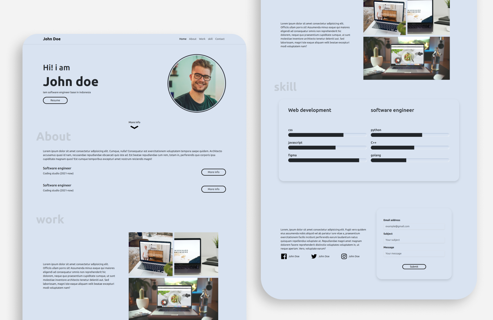

<h1> responsive website-portfolio </h1>

# 
[ BOOTSTRAP](https://getbootstrap.com/)  
[JQuery](https://releases.jquery.com/)

 
 

 
  
  

# section needed  
. Home  
. About  
. Work  
. Contact  

# Requirement  
. Create responsive webpage using bootstrap gridding system and media query  
. Use Bootsrap components (min. 3 commponents)  
. Use JQuery to manipulation DOM (min. 1 manipulation or event)  
. Use JQuery to create animation (min. 1 JQuery animation)  
. Use pseudo class CSS (min. 1 Usage)  
. Use CSS filter (min. 1 Usage)  

